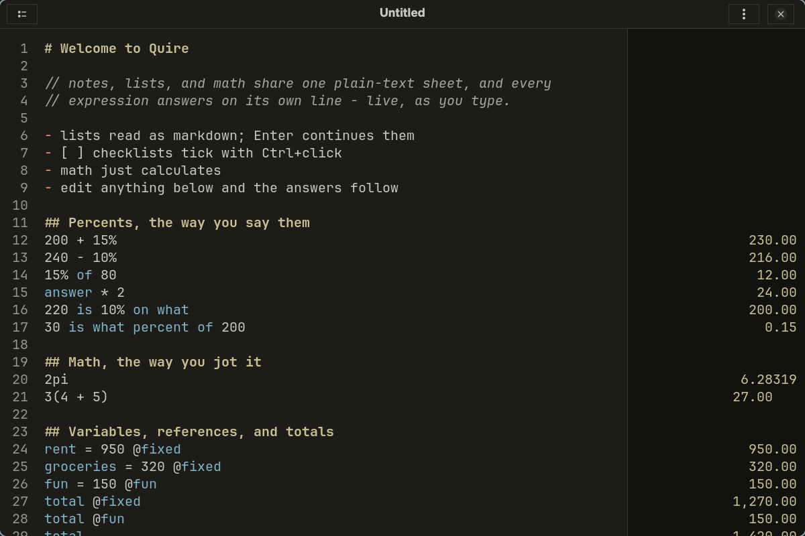

# Quire

A Soulver-style notepad calculator for Linux. Notes and math share one
plain-text sheet: you write, and every expression answers on its own
line in a results column down the right edge.

<p align="center">
  
</p>

The design contract lives in [spec.md](spec.md); the work plan in
[roadmap.md](roadmap.md).

## How a sheet reads

Prose, markdown structure, and math share the page, each with its own
voice (Kanagawa Dragon by default, Lotus when the desktop asks for
light):

```text
# Kitchen remodel

// notes are dimmed italics
cabinets = 2400
counters = 950
total
```

`cabinets` and `counters` render blue (they are variables), the
numbers render plain, and the answers column shows `cabinets = 2400`,
`counters = 950`, `total = 3350` live as you type.

- Per-line results as you type; an error belongs to its line and never
  breaks the others
- Math the way you jot it: `2pi`, `3(4 + 5)`, `(1 + 2)(3 + 4)` all
  multiply without an operator, at `*` precedence
- Variables, bare references (`groceries` on its own line answers with
  its value), `answer`, and `total` for running subtotals
- Percentage forms that match how they are spoken: `200 + 15%` is 230,
  `15% of 200` is 30, and the reverse questions answer too -
  `220 is 10% on what`, `30 is what percent of 200`
- Mixed lines: prose and math on the same line; `50 apples at 3 each`
  evaluates the math and drops the words
- Functions with recursion: `fact(0) = 1`, `fact(n) = n * fact(n - 1)`,
  `fact(6)` → 720
- Tags (`@housing`, `total @housing`) that group lines into sheet-wide
  views, and units with dimension-checked math (`5 kg + 300 g`,
  `26.2 miles -> km`)
- Line references (`&4 + 1` answers with line 4's result plus 1)
  that follow their line when the sheet shifts (a menu toggle,
  on by default) - and they work in both directions: the sheet
  re-evaluates until forward references settle, so a summary line
  at the top can cite the derivation at the bottom
- Dates: `tomorrow`, `90 minutes from now`, `3 weeks from today`
- Recurring amounts: `$1200/month`, `60/quarter` answer as rates that
  keep their period, add across periods, and total dimension-checked
  (a forgotten `/month` fails its total instead of under-counting);
  `$` before a number is decoration
- Currency conversion (offline-first): `50 USD -> EUR` against cached
  ECB daily rates
- Hand-typed price snapshots with dates (`aapl = 10 * 190 @
  2026-10-06`); portfolio, budget (with budget-vs-actual variance),
  trip, a mortgage walkthrough whose summary cites its own
  derivation, a freelance invoice with discount and VAT, a Complex
  Sample for scientists, and two dev torture sheets (a Stress Test
  and an Error Zoo) ship as templates in the menu
- Math functions from the engine's prelude: `sqrt(144)` is 12,
  `sin(30 deg)` is 0.5, `log10` and friends work right on a sheet
- Ctrl+click a math line for its step-by-step breakdown; Ctrl+click
  a `- [ ]` checkbox to tick it
- Answers align on the decimal point within each heading region, and
  the Outline button lists headings plus every defined name
- Markdown structure (headings, lists, task checkboxes, emphasis,
  `//` comments) as styled text; documents are plain UTF-8,
  no lock-in
- Tab completes variable and unit names (acting only on a unique
  match)
- The caret's line carries a subtle band, so you always know where
  you are; Ctrl+click anywhere in it to break down the math
- Errors show a red underline on the exact failing token; hover the
  red cell for the full message
- `quire-cli`: a sheet in, its answers column out - as text or JSON,
  for terminals, scripts, and agents (`--stats` reports the
  fixed-point pass count); `QUIRE_DEBUG=1` turns on the app's
  per-burst diagnostics
- Wayland-native GTK4, no libadwaita, Kanagawa-themed through
  [vir-gtk](https://github.com/VirInvictus/vir-gtk), bundled JetBrains
  Mono

## Status

**1.0** shipped. The whole Soulver-depth surface is in: arithmetic
with implicit multiplication, every percentage form including the
reverse questions in words, variables and totals, functions with
recursion, tags, mixed lines, self-updating line references, dates,
recurring amounts, currency, units, math functions, Tab completion,
the step-by-step breakdown popover, task-list checkboxes,
decimal-aligned answer regions, and the template menu (portfolio,
budget with actuals, trip, and a Complex Sample for scientists).
Development continues toward budget and portfolio depth.

## Building

Rust 1.88+ and the GTK 4 + GtkSourceView 5 development packages
(`gtk4-devel` and `gtksourceview5-devel` on Fedora,
`libgtk-4-dev` and `libgtksourceview-5-dev` on Debian/Ubuntu).

    cargo build
    cargo test

Or the full desktop install through Meson, which puts the binary,
desktop entry, icons, `.quire` mime type, and GSettings schema in
the usual system places:

    meson setup builddir --prefix=/usr
    meson install -C builddir

First run installs JetBrains Mono (SIL OFL 1.1, bundled) under
`~/.local/share/fonts/Quire/` and the sheet language and color
schemes under `~/.local/share/quire/`; nothing else is assumed of the
system. The install and the startup extraction are independent:
either alone gives a working Quire.

## License

MIT. See [LICENSE](LICENSE).
